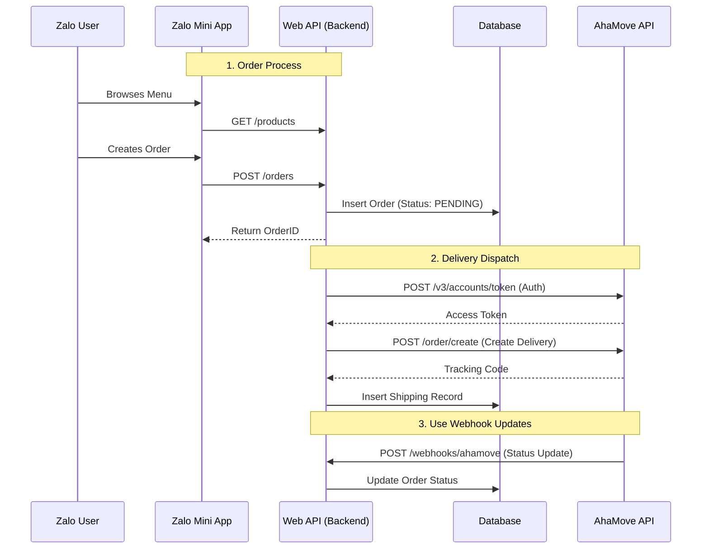
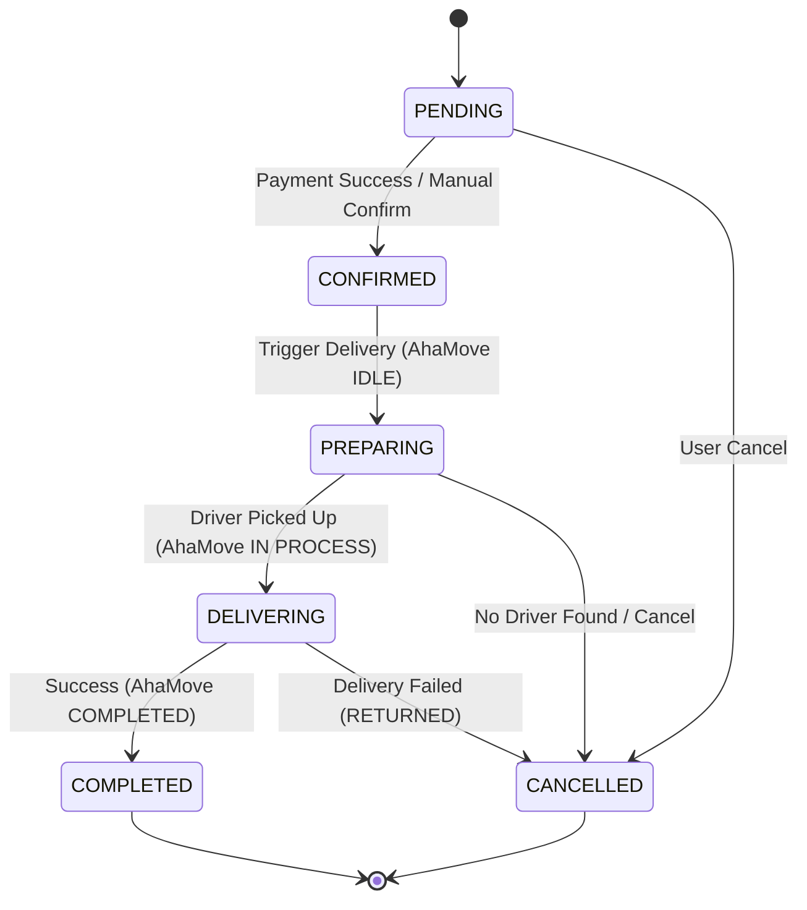

# System Integration & Data Flow Documentation

This document details the architecture and data communication between **Zalo Mini App**, **Web API Backend**, and **AhaMove Delivery Service**.

## 1. High-Level Architecture



## 2. Zalo App <-> Web API Backend

### Data Flow
The Zalo Mini App acts as the frontend client. It is responsible for user authentication (via Zalo) and gathering order details before sending them to the backend.

### Key Interactions

#### A. Order Creation
*   **Endpoint**: `POST /api/orders`
*   **Data Direction**: Client -> Server
*   **Payload**:
    ```json
    {
      "customerId": "ZALO_USER_ID",
      "customerName": "User Name",
      "customerPhone": "090xxxxxxx",  // Retrieved from Zalo with permission
      "items": [ ... ],
      "total": 120000,
      "paymentMethod": "COD" | "ZALO_PAY"
    }
    ```
*   **Processing**:
    1.  Validate inputs.
    2.  Create Order with status `PENDING`.
    3.  (Optional) Upsert Customer record (Loyalty points, history).

#### B. Payment Update (Callback)
*   **Endpoint**: `POST /webhooks/zalo-payment-callback`
*   **Data Direction**: ZaloPay Server -> Server
*   **Trigger**: User completes payment via ZaloPay.
*   **Action**: Updates Order Status from `PENDING` -> `CONFIRMED`.

---

## 3. Backend <-> AhaMove Integration

### Authentication
*   **Mechanism**: Bearer Token (AES-256 Encrypted in DB).
*   **Flow**:
    1.  Check DB for valid token.
    2.  If expired/missing, call `POST https://partner-apistg.ahamove.com/v3/accounts/token` with API Key & Mobile.
    3.  Cache new token for 55 minutes.

### Trigger Delivery (`POST /order/create`)
Data is mapped from the internal Order record to AhaMove's required format:

| Internal Field | AhaMove Field | Notes |
| :--- | :--- | :--- |
| `Store Address` | `path[0]` | Fixed pickup location |
| `customerAddress` | `path[1].address` | Delivery destination |
| `customerName` | `path[1].name` | Receiver name |
| `customerPhone` | `path[1].mobile` | Receiver phone |
| `serviceType` | `service_id` | e.g., `SGN-BIKE` |

### Webhook Updates (`POST /webhooks/ahamove`)
AhaMove pushes status updates in real-time. The backend maps these external statuses to internal business logic.

---

## 4. Order Status Lifecycle

 The system uses a unified status flow to synchronize internal operations with delivery progress.

### Status Mapping Table

| AhaMove Status | Internal Status | Description |
| :--- | :--- | :--- |
| **(Initial)** | `PENDING` | Order created, waiting for payment/confirmation. |
| **(Payment)** | `CONFIRMED` | Payment received (COD or ZaloPay). |
| `IDLE` | `PREPARING` | Delivery request sent to AhaMove. System looking for driver. |
| `ASSIGNING` | `PREPARING` | AhaMove is finding a driver. |
| `ACCEPTED` | `PREPARING` | Driver accepted. Kitchen is preparing food. |
| `IN PROCESS` | `DELIVERING` | Driver has picked up food (`PICKING UP` events included here). |
| `COMPLETED` | `COMPLETED` | Food delivered successfully. |
| `CANCELLED` | `CANCELLED` | Delivery or Order cancelled. |
| `RETURNED` | `CANCELLED` | Delivery failed and returned to store. |

### State Machine View


