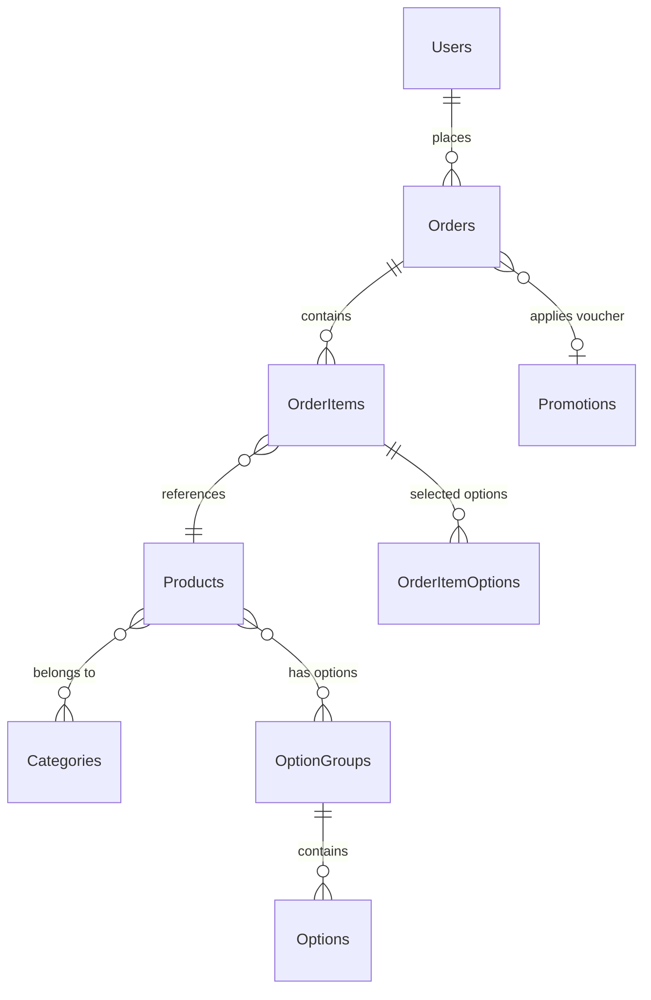

# Product Requirements Document
## Coffee Shop Management Dashboard

**Version:** 1.0  
**Date:** 2025-11-25  
**Status:** Draft

---

## Executive Summary

A web-based management dashboard for coffee shop operations, designed to provide shop owners and staff with precise control over orders, inventory, customers, and analytics. The system prioritizes clarity, speed, and correctness.

**Core Principle:** Every interaction should be obvious. Every operation should be reversible. Every calculation should be verifiable.

---

## I. System Architecture

### Technology Stack

| Layer | Technology | Justification |
|-------|-----------|---------------|
| Frontend Framework | React + TypeScript | Type safety, component reusability |
| UI Components | shadcn/ui | Accessible, customizable, lightweight |
| Styling | Tailwind CSS | Utility-first, consistent spacing |
| Design System | Material Design 3 | Proven patterns, accessibility |
| State Management | React Query + Zustand | Server state + client state separation |
| Backend API | REST/GraphQL | (To be integrated with existing Zalo Mini App backend) |
| Database | PostgreSQL | Relational integrity, ACID compliance |

### Design Principles

Following Material Design 3:
- **Color Scheme:** Light theme with latte tones (soft browns, creams, warm grays)
- **Typography:** Roboto/Inter for clarity
- **Elevation:** 0-5 levels using shadows
- **Motion:** 200-300ms transitions, easing curves
- **Spacing:** 4px base unit (8px, 16px, 24px, 32px)

---

## II. Functional Requirements

### Feature Category 1: Order Management

**Purpose:** Track orders from creation to completion with zero ambiguity.

#### F1.1 Order List View
**Function:** Display all orders in reverse chronological order.

**Requirements:**
- Show order ID, customer name, total, status, timestamp
- Support pagination (20 orders per page)
- Filter by status: `PENDING | CONFIRMED | PREPARING | DELIVERING | COMPLETED | CANCELLED`
- Filter by date range (calendar picker)
- Search by order ID or customer name (fuzzy match)
- Real-time updates via polling (30s interval) or WebSocket

**UI Components:**
- `Table` (shadcn)
- `Select` for status filter
- `DateRangePicker` for date filter
- `Input` with search icon
- `Badge` for status display

**Algorithm:**
```
function filterOrders(orders, filters):
  result = orders
  if filters.status ≠ null:
    result = result.filter(o => o.status == filters.status)
  if filters.dateRange ≠ null:
    result = result.filter(o => o.created_at ∈ filters.dateRange)
  if filters.search ≠ empty:
    result = fuzzySearch(result, filters.search, ['id', 'customer_name'])
  return result.sort_by(created_at, DESC)
```

#### F1.2 Order Detail View
**Function:** Show complete order information with line-item breakdown.

**Requirements:**
- Display customer info (name, phone, address)
- Show order items with options (e.g., "Latte - Size M - 50% Sugar")
- Calculate subtotal, shipping fee, discount, total (must match to 2 decimal places)
- Show status history timeline
- Enable status transitions (with confirmation)
- Print receipt action

**UI Components:**
- `Card` for sections
- `Table` for line items
- `Timeline` for status history
- `AlertDialog` for status confirmation
- `Button` for actions

**Business Rules:**
```
Status Transitions (Directed Acyclic Graph):
PENDING → CONFIRMED → PREPARING → DELIVERING → COMPLETED
         ↓           ↓           ↓
      CANCELLED  CANCELLED  CANCELLED

Constraint: No transition from COMPLETED or CANCELLED
```

#### F1.3 Order Status Update
**Function:** Change order status with validation.

**Requirements:**
- Validate transition legality
- Require confirmation for CANCELLED status
- Log timestamp and user ID for each transition
- Send notification to customer (via Zalo OA)

**Validation Algorithm:**
```
function canTransition(currentStatus, newStatus):
  validTransitions = {
    'PENDING': ['CONFIRMED', 'CANCELLED'],
    'CONFIRMED': ['PREPARING', 'CANCELLED'],
    'PREPARING': ['DELIVERING', 'CANCELLED'],
    'DELIVERING': ['COMPLETED'],
    'COMPLETED': [],
    'CANCELLED': []
  }
  return newStatus ∈ validTransitions[currentStatus]
```

---

### Feature Category 2: Menu Management

**Purpose:** Maintain product catalog with precision and flexibility.

#### F2.1 Product List
**Function:** Display all products grouped by category.

**Requirements:**
- Group by category (collapsible sections)
- Show product name, image, base price, availability
- Sort by: name, price, created date
- Quick toggle for availability (optimistic UI update)
- Bulk actions: delete, toggle category

**UI Components:**
- `Accordion` for categories
- `DataTable` with sorting
- `Switch` for availability toggle
- `Checkbox` for multi-select

#### F2.2 Product Form (Create/Edit)
**Function:** Add or modify product details.

**Requirements:**
- Input: name (max 255 chars), description (max 1000 chars)
- Upload image (max 5MB, format: JPG/PNG/WebP)
- Set base price (min 0, max 10,000,000, precision 2 decimals)
- Select category (single select)
- Assign option groups (multi-select)
- Set availability (boolean)

**Validation Rules:**
```
validate_product(product):
  assert 1 ≤ len(product.name) ≤ 255
  assert 0 ≤ len(product.description) ≤ 1000
  assert 0 ≤ product.base_price ≤ 10,000,000
  assert product.base_price % 0.01 == 0
  assert product.category_id exists in Categories
  assert ∀ group_id ∈ product.option_groups: group_id exists in OptionGroups
```

**UI Components:**
- `Form` with validation
- `Input` with character counter
- `Textarea` with character counter
- `FileUpload` with preview
- `Select` for category
- `MultiSelect` for option groups
- `Switch` for availability

#### F2.3 Category Management
**Function:** Organize products into categories.

**Requirements:**
- CRUD operations for categories
- Set display order (drag-and-drop or numeric input)
- Upload category icon
- Toggle active/inactive

**UI Components:**
- `DragDropList` for ordering
- `Dialog` for create/edit form

#### F2.4 Option Groups & Options
**Function:** Define customization options (size, toppings, etc.).

**Requirements:**
- Create option groups (e.g., "Size", "Toppings")
- Set selection type: SINGLE (radio) or MULTIPLE (checkbox)
- Set min/max selections
- Add options with price adjustments (can be negative)
- Set default option per group

**Data Structure:**
```
OptionGroup {
  id: string
  name: string
  selection_type: 'SINGLE' | 'MULTIPLE'
  min_select: int (≥ 0)
  max_select: int (≥ min_select)
  options: Option[]
}

Option {
  id: string
  name: string
  price_adjustment: decimal
  is_default: boolean
}
```

**UI Components:**
- `RadioGroup` or `CheckboxGroup` based on selection type
- `Input[type=number]` for price adjustment

---

### Feature Category 3: Customer Management

**Purpose:** Understand customer behavior and enable targeted engagement.

#### F3.1 Customer List
**Function:** View all customers with segmentation.

**Requirements:**
- Display name, phone, loyalty points, segment, total orders
- Segment calculation:
  - NEW: 0-1 orders
  - REGULAR: 2-9 orders
  - VIP: ≥10 orders
- Sort by: name, points, total orders, last order date
- Search by name or phone (partial match)

**Segmentation Algorithm:**
```
function calculateSegment(orderCount):
  if orderCount ≤ 1:
    return 'NEW'
  else if orderCount < 10:
    return 'REGULAR'
  else:
    return 'VIP'
```

**UI Components:**
- `DataTable` with sorting and filtering
- `Badge` for segment display (color-coded)

#### F3.2 Customer Detail
**Function:** View individual customer profile.

**Requirements:**
- Show basic info (name, phone, avatar, Zalo ID)
- Display loyalty points balance
- Show purchase history (recent 20, paginated)
- Calculate lifetime value (sum of all completed orders)
- Show favorite products (top 3 by order frequency)

**Calculations:**
```
ltv(customer) = Σ(order.total_amount) where order.status = 'COMPLETED'

favoriteProducts(customer) = 
  topK(3, groupBy(order_items, product_id), key=count, desc)
```

**UI Components:**
- `Card` for profile section
- `Table` for purchase history
- `Chart` (bar) for favorite products

#### F3.3 Loyalty Points
**Function:** Display and manage customer points.

**Requirements:**
- Points earned: 1 point per 1,000₫ spent (on completed orders)
- Points displayed as integer (rounded down)
- Enable manual point adjustment (admin only)

**Points Calculation:**
```
function calculatePoints(orderTotal):
  return floor(orderTotal / 1000)
```

---

### Feature Category 4: Promotions

**Purpose:** Create and manage discount campaigns.

#### F4.1 Voucher List
**Function:** View all promotion codes.

**Requirements:**
- Display code, description, discount, usage, validity period
- Show status: ACTIVE, UPCOMING, EXPIRED
- Filter by status
- Toggle active/inactive (admin only)

**Status Logic:**
```
function getVoucherStatus(voucher, now):
  if now < voucher.start_date:
    return 'UPCOMING'
  else if now > voucher.end_date:
    return 'EXPIRED'
  else if voucher.usage_count >= voucher.usage_limit:
    return 'DEPLETED'
  else:
    return 'ACTIVE'
```

**UI Components:**
- `DataTable`
- `Badge` for status

#### F4.2 Create Voucher
**Function:** Define discount rules.

**Requirements:**
- Code: alphanumeric, 6-20 chars, unique
- Description: max 500 chars
- Discount type: PERCENT or FIXED
- Discount value:
  - PERCENT: 1-100
  - FIXED: > 0
- Min order value: ≥ 0
- Max discount (for PERCENT type): optional
- Start/end date: end > start
- Usage limit: > 0

**Discount Calculation:**
```
function calculateDiscount(voucher, orderTotal):
  if voucher.type == 'PERCENT':
    discount = orderTotal * (voucher.value / 100)
    if voucher.max_discount ≠ null:
      discount = min(discount, voucher.max_discount)
  else:
    discount = voucher.value
  
  return min(discount, orderTotal)
```

**UI Components:**
- `Form` with validation
- `RadioGroup` for discount type
- `DateTimePicker` for validity period

---

### Feature Category 5: Analytics

**Purpose:** Provide actionable insights through data visualization.

#### F5.1 Revenue Dashboard
**Function:** Display financial metrics.

**Requirements:**
- Date range selector (default: last 30 days)
- Total revenue (sum of completed orders)
- Total orders count
- Average order value
- Revenue trend line chart (daily granularity)
- Compare with previous period (% change)

**Calculations:**
```
revenue(dateRange) = 
  Σ(order.total_amount) where order.status = 'COMPLETED' 
  and order.created_at ∈ dateRange

averageOrderValue = revenue / orderCount
percentChange = ((current - previous) / previous) * 100
```

**UI Components:**
- `DateRangePicker`
- `Card` for metrics
- `LineChart` (recharts or tremor)
- `Badge` for % change (green if positive, red if negative)

#### F5.2 Product Performance
**Function:** Identify best and worst sellers.

**Requirements:**
- Show top 10 products by quantity sold
- Show top 10 by revenue generated
- Display as horizontal bar chart
- Click to drill down to product detail

**Query:**
```
SELECT 
  product_id,
  product_name,
  SUM(quantity) as total_quantity,
  SUM(total_price) as total_revenue
FROM order_items
JOIN orders ON order_items.order_id = orders.id
WHERE orders.status = 'COMPLETED'
  AND orders.created_at >= :start_date
  AND orders.created_at <= :end_date
GROUP BY product_id, product_name
ORDER BY total_quantity DESC
LIMIT 10
```

**UI Components:**
- `BarChart`
- `Tabs` to switch between quantity/revenue view

#### F5.3 Peak Hours Analysis
**Function:** Identify busiest times.

**Requirements:**
- Group orders by hour of day (0-23)
- Display as column chart
- Show order count per hour
- Date range filter

**Aggregation:**
```
SELECT 
  EXTRACT(HOUR FROM created_at) as hour,
  COUNT(*) as order_count
FROM orders
WHERE status = 'COMPLETED'
  AND created_at >= :start_date
  AND created_at <= :end_date
GROUP BY hour
ORDER BY hour
```

**UI Components:**
- `ColumnChart`

#### F5.4 Export Data
**Function:** Download reports as Excel.

**Requirements:**
- Export format: XLSX
- Include: orders, order items, customers, products
- Apply current filters/date range
- Max 10,000 rows per export

---

### Feature Category 6: Team Management

**Purpose:** Control access with role-based permissions.

#### F6.1 User List
**Function:** View all staff accounts.

**Requirements:**
- Display name, email, role, status, last login
- Filter by role
- Search by name or email

**UI Components:**
- `DataTable`
- `Badge` for role

#### F6.2 Create/Edit User
**Function:** Manage staff accounts.

**Requirements:**
- Email (unique, valid format)
- Name (1-100 chars)
- Role: ADMIN, MANAGER, STAFF
- Status: ACTIVE, INACTIVE

**Permission Matrix:**
```
| Feature          | ADMIN | MANAGER | STAFF |
|------------------|-------|---------|-------|
| View Orders      | ✓     | ✓       | ✓     |
| Update Orders    | ✓     | ✓       | ✓     |
| View Customers   | ✓     | ✓       | ✓     |
| Manage Menu      | ✓     | ✓       | ✗     |
| Manage Promotions| ✓     | ✓       | ✗     |
| View Analytics   | ✓     | ✓       | ✗     |
| Manage Team      | ✓     | ✗       | ✗     |
| Manage Settings  | ✓     | ✗       | ✗     |
```

**UI Components:**
- `Form`
- `Select` for role
- `Switch` for status

#### F6.3 Activity Log
**Function:** Audit trail of user actions.

**Requirements:**
- Log: user ID, action, resource, timestamp
- Actions: CREATE, UPDATE, DELETE, STATUS_CHANGE
- Retention: 90 days
- Display recent 100 actions (paginated)

**UI Components:**
- `Table`
- `Badge` for action type

---

### Feature Category 7: Settings

**Purpose:** Configure system-wide parameters.

#### F7.1 Store Settings
**Function:** Basic store information.

**Requirements:**
- Store name (max 100 chars)
- Phone (10-15 digits)
- Address (max 500 chars)
- Operating hours (open/close time per day of week)

**UI Components:**
- `Form`
- `TimePicker` for hours

#### F7.2 Delivery Settings
**Function:** Shipping fee calculation.

**Requirements:**
- Base fee (≥ 0)
- Per km rate (≥ 0)
- Free shipping threshold (optional)

**Calculation:**
```
function calculateShippingFee(distance, orderTotal, settings):
  fee = settings.base_fee + (distance * settings.per_km_rate)
  if settings.free_shipping_threshold ≠ null:
    if orderTotal >= settings.free_shipping_threshold:
      return 0
  return fee
```

**UI Components:**
- `Form`
- `Input[type=number]`

#### F7.3 Payment Methods
**Function:** Enable/disable payment options.

**Requirements:**
- COD (enabled by default)
- ZaloPay (toggle)
- Momo (toggle)
- Bank Transfer (toggle)

**UI Components:**
- `Switch` for each method

---

## III. Non-Functional Requirements

### NFR1: Performance

| Metric | Target | Measurement |
|--------|--------|-------------|
| Page Load Time | < 2s | First Contentful Paint |
| API Response | < 500ms | P95 latency |
| Table Pagination | < 100ms | Click to render |
| Search Debounce | 300ms | Input delay |
| Real-time Updates | 30s | Polling interval |

**Optimization Strategies:**
- Code splitting per route
- Lazy loading for charts
- Virtual scrolling for large tables (>100 rows)
- Memoization for expensive calculations
- React Query caching (5min stale time)

### NFR2: Usability

**Accessibility (WCAG 2.1 Level AA):**
- Keyboard navigation for all interactive elements
- ARIA labels for screen readers
- Color contrast ratio ≥ 4.5:1
- Focus indicators visible
- Form validation errors announced

**Responsive Design:**
- Desktop: ≥ 1280px (primary)
- Tablet: 768-1279px (supported)
- Mobile: < 768px (not required for v1.0)

**Error Handling:**
- Display user-friendly error messages
- Provide recovery actions
- Log errors to monitoring service
- Offline state detection with retry

### NFR3: Security

**Authentication:**
- Session-based or JWT token
- Session timeout: 8 hours of inactivity
- Require re-authentication for sensitive actions (delete, refund)

**Authorization:**
- Role-based access control (see permission matrix)
- API endpoints enforce permissions server-side
- Hide UI elements for unauthorized actions

**Data Protection:**
- HTTPS only (TLS 1.2+)
- Sanitize user inputs (XSS prevention)
- SQL injection prevention (parameterized queries)
- No sensitive data in logs

**Rate Limiting:**
- API: 100 requests/minute per user
- Login attempts: 5 failures → 15min lockout

### NFR4: Reliability

**Uptime:** 99.5% (excluding planned maintenance)

**Data Integrity:**
- Database transactions for multi-step operations
- Foreign key constraints enforced
- Cascade deletes configured correctly
- Soft delete for orders and customers (set `deleted_at`)

**Backup:**
- Database: Daily incremental, weekly full
- Retention: 30 days

**Error Recovery:**
- Automatic retry for transient failures (3 attempts, exponential backoff)
- Rollback on partial failures

### NFR5: Maintainability

**Code Standards:**
- TypeScript strict mode
- ESLint + Prettier enforced
- No `any` types without justification
- Function complexity < 10 (cyclomatic)
- Test coverage ≥ 80% for business logic

**Documentation:**
- JSDoc for public functions
- README per module
- API documentation (OpenAPI/Swagger)

**Versioning:**
- Semantic versioning (semver)
- Changelog maintained

### NFR6: Scalability

**Concurrency:**
- Support 50 concurrent users (v1.0)
- Optimistic locking for concurrent updates

**Data Volume:**
- 10,000 orders/month
- 1,000 products
- 5,000 customers

**Growth Plan:**
- Horizontal scaling for API (stateless)
- Database read replicas if needed
- CDN for static assets

---

## IV. UI/UX Design System

### Color Palette (Light Latte Theme)

Based on Material Design 3 with coffee-inspired tones:

```css
/* Primary (Espresso) */
--primary-50: #f3f0ed;
--primary-100: #e7dfd7;
--primary-200: #d0bfaf;
--primary-300: #b89e87;
--primary-400: #a17e5f;
--primary-500: #8a5e37;  /* Main */
--primary-600: #6e4b2c;
--primary-700: #533821;
--primary-800: #372516;
--primary-900: #1c130b;

/* Secondary (Caramel) */
--secondary-50: #faf7f4;
--secondary-100: #f5efe8;
--secondary-200: #ebdfd1;
--secondary-300: #e0cfba;
--secondary-400: #d6bfa3;
--secondary-500: #ccaf8c;  /* Main */
--secondary-600: #a38c70;
--secondary-700: #7a6954;
--secondary-800: #524638;
--secondary-900: #29231c;

/* Neutrals (Cream) */
--neutral-50: #fafaf9;
--neutral-100: #f5f5f4;
--neutral-200: #e7e5e4;
--neutral-300: #d6d3d1;
--neutral-400: #a8a29e;
--neutral-500: #78716c;
--neutral-600: #57534e;
--neutral-700: #44403c;
--neutral-800: #292524;
--neutral-900: #1c1917;

/* Semantic Colors */
--success: #059669;  /* Green for completed, active */
--warning: #d97706;  /* Amber for pending, warnings */
--error: #dc2626;    /* Red for cancelled, errors */
--info: #0284c7;     /* Blue for informational */

/* Surface */
--surface: #ffffff;
--surface-variant: #f5f5f4;
--outline: #d6d3d1;
```

### Typography

```css
/* Font Family */
--font-sans: 'Inter', -apple-system, BlinkMacSystemFont, 'Segoe UI', sans-serif;
--font-mono: 'JetBrains Mono', 'Fira Code', monospace;

/* Type Scale */
--text-xs: 0.75rem;    /* 12px */
--text-sm: 0.875rem;   /* 14px */
--text-base: 1rem;     /* 16px */
--text-lg: 1.125rem;   /* 18px */
--text-xl: 1.25rem;    /* 20px */
--text-2xl: 1.5rem;    /* 24px */
--text-3xl: 1.875rem;  /* 30px */
--text-4xl: 2.25rem;   /* 36px */

/* Line Height */
--leading-tight: 1.25;
--leading-normal: 1.5;
--leading-relaxed: 1.75;

/* Font Weight */
--font-normal: 400;
--font-medium: 500;
--font-semibold: 600;
--font-bold: 700;
```

### Spacing Scale

Based on 4px grid:

```css
--space-1: 0.25rem;   /* 4px */
--space-2: 0.5rem;    /* 8px */
--space-3: 0.75rem;   /* 12px */
--space-4: 1rem;      /* 16px */
--space-5: 1.25rem;   /* 20px */
--space-6: 1.5rem;    /* 24px */
--space-8: 2rem;      /* 32px */
--space-10: 2.5rem;   /* 40px */
--space-12: 3rem;     /* 48px */
--space-16: 4rem;     /* 64px */
```

### Elevation (Shadows)

```css
--shadow-sm: 0 1px 2px 0 rgb(0 0 0 / 0.05);
--shadow-md: 0 4px 6px -1px rgb(0 0 0 / 0.1);
--shadow-lg: 0 10px 15px -3px rgb(0 0 0 / 0.1);
--shadow-xl: 0 20px 25px -5px rgb(0 0 0 / 0.1);
```

### Border Radius

```css
--radius-sm: 0.25rem;  /* 4px */
--radius-md: 0.375rem; /* 6px */
--radius-lg: 0.5rem;   /* 8px */
--radius-xl: 0.75rem;  /* 12px */
--radius-full: 9999px;
```

### Motion

```css
--duration-fast: 150ms;
--duration-base: 200ms;
--duration-slow: 300ms;
--easing: cubic-bezier(0.4, 0.0, 0.2, 1);
```

### Component Patterns

**Button Variants:**
- Primary: `bg-primary-500 text-white hover:bg-primary-600`
- Secondary: `bg-secondary-100 text-secondary-900 hover:bg-secondary-200`
- Outline: `border-2 border-primary-500 text-primary-500`
- Ghost: `text-primary-500 hover:bg-primary-50`

**Card Layout:**
```tsx
<Card className="p-6 shadow-md border border-neutral-200">
  <CardHeader>
    <CardTitle className="text-2xl font-semibold">Title</CardTitle>
  </CardHeader>
  <CardContent>
    {/* Content */}
  </CardContent>
</Card>
```

**Table Style:**
- Header: `bg-neutral-50 text-neutral-900 font-semibold`
- Row hover: `hover:bg-neutral-50`
- Border: `border-b border-neutral-200`

**Status Badges:**
```tsx
const statusColors = {
  PENDING: 'bg-warning/10 text-warning border-warning/20',
  CONFIRMED: 'bg-info/10 text-info border-info/20',
  PREPARING: 'bg-info/10 text-info border-info/20',
  DELIVERING: 'bg-info/10 text-info border-info/20',
  COMPLETED: 'bg-success/10 text-success border-success/20',
  CANCELLED: 'bg-error/10 text-error border-error/20',
}
```

---

## V. Data Model Integration

Reference: [schema-design.md](file:///Users/macbook/Desktop/opensources/CoffeeZMA/docs/planning/schema-design.md)

### Key Relationships



### API Endpoints

Following REST conventions:

**Orders:**
- `GET /api/orders` - List orders (with filters)
- `GET /api/orders/:id` - Get order detail
- `PATCH /api/orders/:id/status` - Update status
- `POST /api/orders/:id/print` - Print receipt

**Products:**
- `GET /api/products` - List products
- `POST /api/products` - Create product
- `GET /api/products/:id` - Get product
- `PUT /api/products/:id` - Update product
- `DELETE /api/products/:id` - Delete product
- `PATCH /api/products/:id/availability` - Toggle availability

**Customers:**
- `GET /api/customers` - List customers
- `GET /api/customers/:id` - Get customer detail
- `POST /api/customers/:id/points` - Adjust points (admin)

**Promotions:**
- `GET /api/promotions` - List vouchers
- `POST /api/promotions` - Create voucher
- `PUT /api/promotions/:id` - Update voucher
- `DELETE /api/promotions/:id` - Delete voucher

**Analytics:**
- `GET /api/analytics/revenue?start=&end=` - Revenue metrics
- `GET /api/analytics/products?start=&end=` - Product performance
- `GET /api/analytics/peak-hours?start=&end=` - Peak hours

**Team:**
- `GET /api/users` - List users
- `POST /api/users` - Create user
- `PUT /api/users/:id` - Update user
- `DELETE /api/users/:id` - Delete user

**Settings:**
- `GET /api/settings` - Get all settings
- `PUT /api/settings` - Update settings

---

## VI. Success Metrics

### User Metrics
- Time to process an order: < 30 seconds
- Product update frequency: > 5 updates/week
- Dashboard daily active users: ≥ 80% of staff

### Technical Metrics
- Page load time: < 2s (P95)
- Error rate: < 0.5%
- Uptime: > 99.5%

### Business Metrics
- Order processing efficiency: 95% confirmed within 5 minutes
- Data accuracy: 100% (order totals match calculations)
- Staff adoption: 100% within 2 weeks of launch

---

## VII. Acceptance Criteria

A feature is complete when:

1. **Functionality:** All requirements implemented and tested
2. **Code Quality:** Passes linting, type checking, test coverage ≥ 80%
3. **UI/UX:** Matches design system, accessible (keyboard + screen reader)
4. **Performance:** Meets NFR targets
5. **Documentation:** Function documentation, usage examples, edge cases noted
6. **Review:** Code reviewed by peer, approved by tech lead

---

## VIII. Out of Scope (v1.0)

The following are explicitly NOT included:

- Mobile app (native iOS/Android)
- Multi-store management
- Inventory tracking (stock levels)
- Employee scheduling
- POS integration (physical terminal)
- AI recommendations
- WhatsApp/SMS notifications
- Multi-language support

---

## IX. Appendix

### Glossary

- **LTV:** Lifetime Value - total revenue from a customer
- **SKU:** Stock Keeping Unit - unique product identifier
- **CRUD:** Create, Read, Update, Delete operations
- **RBAC:** Role-Based Access Control
- **P95:** 95th percentile (performance metric)

### References

- [Feature List](file:///Users/macbook/Desktop/opensources/CoffeeZMA/docs/planning/feature-list.md)
- [Schema Design](file:///Users/macbook/Desktop/opensources/CoffeeZMA/docs/planning/schema-design.md)
- [Material Design 3](https://m3.material.io/)
- [shadcn/ui Documentation](https://ui.shadcn.com/)
- [WCAG 2.1 Guidelines](https://www.w3.org/WAI/WCAG21/quickref/)

---

**Principle:** "Make it work, make it right, make it fast." — Kent Beck

**Principle:** "Premature optimization is the root of all evil." — Donald Knuth

**This document embodies both:** Precise specifications (Knuth) with clear, testable requirements (Beck).
