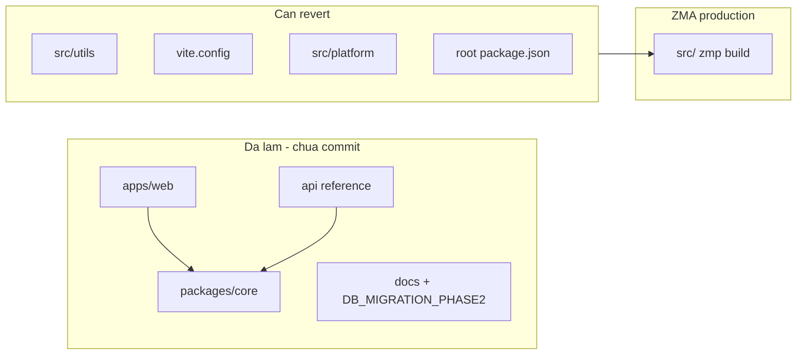
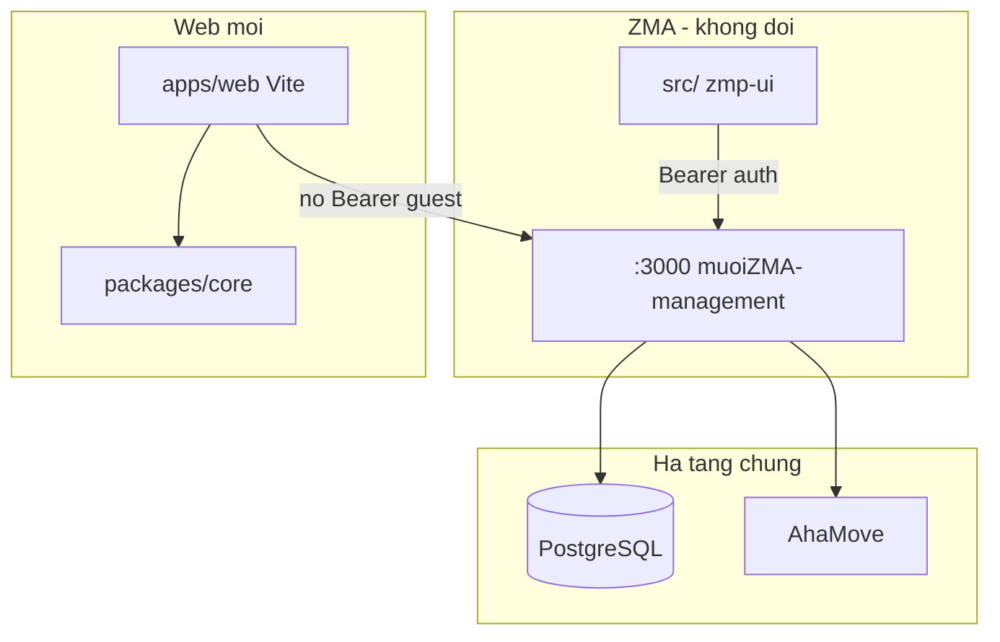
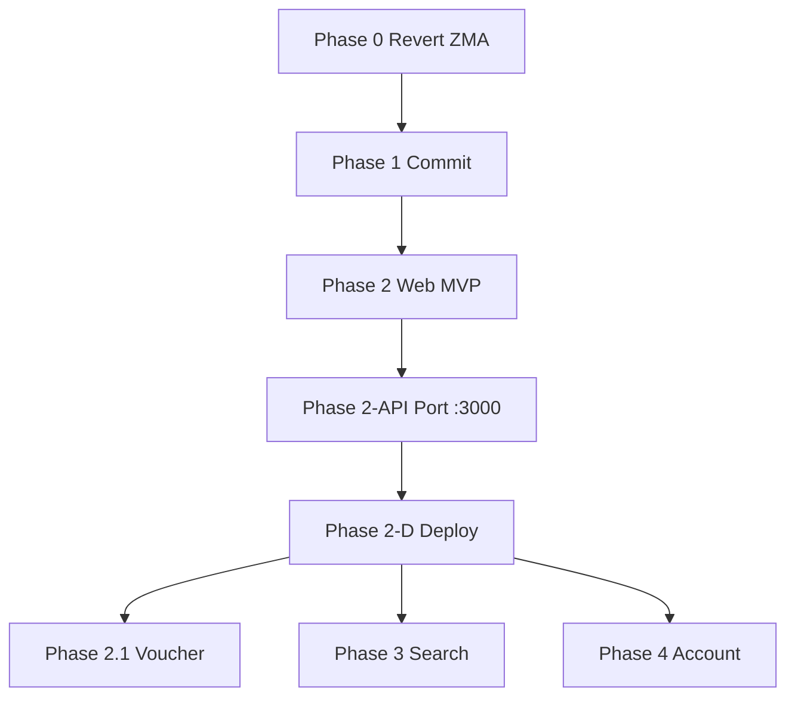

# Plan: Clone ZMA → Web Standalone (ZMA Zero-Touch)

**Cập nhật lần cuối:** 2026-06-27  
**Trạng thái tổng:** Phase 0 pending — revert ZMA contamination trước commit

Kế hoạch clone Zalo Mini App sang web standalone (`apps/web`), tận dụng code đã có (~95% MVP), khôi phục ZMA về trạng thái zero-touch, và port API guest checkout vào backend `:3000` ([muoiZMA-management](../../muoiZMA-management)) theo hướng additive — không phá flow ZMA đang chạy.

**Tài liệu liên quan:** [orders-contract.md](../api/orders-contract.md) · [apps/web/README.md](../../apps/web/README.md) · [api/README.md](../../api/README.md)

---

## Bối cảnh & mục tiêu

**Mục tiêu:** Có web app chạy trên trình duyệt (không `zmp-ui` / `zmp-sdk`), khách có thể duyệt menu → giỏ → checkout COD → tra cứu đơn.

**Ràng buộc:** ZMA [`src/`](../../src/) đang production — **không refactor, không coupling** với web.

**Quyết định deploy API:** Port endpoint **additive** vào muoiZMA-management (`:3000`), không deploy [`api/`](../../api/) riêng làm backend chính. `api/` giữ vai trò **reference + dev local** cho đến khi port xong.

---

## Bảng tiến độ nhanh

| Phase | Tên | Trạng thái |
|-------|-----|------------|
| **0** | Khôi phục ZMA (revert contamination) | Pending |
| **1** | Commit monorepo web-only | Pending |
| **2** | Guest checkout MVP (web) | ~95% |
| **2-API** | Port endpoint vào `:3000` | Pending |
| **2-D** | Deploy staging/production | Pending |
| **2.1** | Voucher | Pending |
| **3** | Search & browse | Pending |
| **4** | Account & retention | Pending |

---

## Trạng thái hiện tại (working tree)



| Hạng mục | Trạng thái | Ghi chú |
|----------|------------|---------|
| [`packages/core`](../../packages/core) | Done | 18 tests pass; mirror logic từ ZMA utils |
| [`apps/web`](../../apps/web) | ~95% MVP | Home, Category, Cart, Checkout, Success; Search/Profile/Notification = placeholder |
| [`api/`](../../api/) | Done (reference) | Port sang muoiZMA-management |
| [`DB_MIGRATION_PHASE2.sql`](../../DB_MIGRATION_PHASE2.sql) | Written | Chưa apply production |
| ZMA `src/utils/*` | **Contaminated** | 6 file re-export `@muoi/core` — **phải revert** |
| `src/platform/` | Untracked, unused | Xóa hoặc không commit |
| Root [`package.json`](../../package.json) | Modified | workspaces + `@muoi/core` dep — cần tách |

**Parity routes (ZMA vs Web):**

| ZMA ([`layout.tsx`](../../src/components/layout.tsx)) | Web ([`App.tsx`](../../apps/web/src/App.tsx)) |
|------------------------------------------------------|-----------------------------------------------|
| `/`, `/category`, `/cart`, `/result` | `/`, `/category`, `/cart`, `/order/success` |
| `/search`, `/notification`, `/profile` | Placeholder |
| `/order-history`, `/order-status` | Chưa có |

---

## Kiến trúc mục tiêu



**Nguyên tắc coupling:**

- `@muoi/core` chỉ được import bởi `apps/web` và (tạm thời) `api/` dev — **không** import từ `src/`.
- Sửa giá/validation: cập nhật `@muoi/core` + port logic sang muoiZMA-management; ZMA `src/utils/` giữ bản gốc độc lập.
- DB migration chỉ **additive** (`ADD COLUMN IF NOT EXISTS`).

---

## Phase 0 — Khôi phục ZMA (bắt buộc trước commit)

**Mục tiêu:** `git diff src/` trống; ZMA build/start giống production.

### Checklist

- [ ] Revert về `HEAD`: `src/utils/checkout-validation.ts`, `location.ts`, `loyalty.ts`, `phone.ts`, `pricing.ts`, `product.ts`
- [ ] Revert [`vite.config.mts`](../../vite.config.mts) — bỏ alias `@muoi/core` và `platform`
- [ ] Revert [`tsconfig.json`](../../tsconfig.json) — bỏ paths `@muoi/core`, `platform`
- [ ] Xóa [`src/platform/`](../../src/platform/) (chưa được page ZMA import)
- [ ] Sửa root [`package.json`](../../package.json): giữ workspaces + script `dev:web` / `test:core`; **bỏ** `"@muoi/core": "*"` khỏi `dependencies` root

### Gate kiểm tra

```bash
git diff src/ vite.config.mts tsconfig.json   # phải trống
npm start && npm run build                     # ZMA regression
npm run test:core && npm run test:web          # web stack vẫn pass
```

---

## Phase 1 — Hoàn thiện monorepo web-only

**Mục tiêu:** Cấu trúc repo ổn định, ZMA và web cùng repo nhưng tách biệt.

| Deliverable | Path |
|-------------|------|
| Shared logic (web) | [`packages/core`](../../packages/core) |
| Web app | [`apps/web`](../../apps/web) |
| API reference (local dev) | [`api/`](../../api/) |
| Contract | [orders-contract.md](../api/orders-contract.md) |

**Commit đầu tiên** chỉ gồm: `packages/`, `apps/`, `api/`, `docs/`, `DB_MIGRATION_PHASE2.sql`, thay đổi `package.json` tối thiểu (workspaces/scripts) — **không** `src/`.

- [ ] Commit Phase 1

---

## Phase 2 — Guest checkout MVP (web)

**Tiến độ ~95%.**

### Đã có

- [x] Catalog: banners, categories, products, branches
- [x] Product picker + variants
- [x] Cart + checkout form
- [x] COD qua `webPlatformAdapter`
- [x] Order success + lookup code
- [x] Tests: 6 web + 18 core

### Còn thiếu

- [ ] Map address picker (TrackAsia hoặc tương đương web)
- [ ] `VITE_API_URL` production trỏ `:3000` sau Phase 2-API
- [ ] E2E manual: Home → checkout COD → success có `lookupCode`

---

## Phase 2-API — Port endpoint vào muoiZMA-management (`:3000`)

**Nguồn port:** logic từ [`api/lib/`](../../api/lib/) → TypeScript trong muoiZMA-management.

| Method | Path | Hành động |
|--------|------|-----------|
| `POST` | `/api/orders` | Mở rộng handler hiện có: guest upsert, server price validation, `lookupCode`, response `201` |
| `POST` | `/api/shipping/estimate` | Thêm mới — proxy AhaMove v3 |
| `GET` | `/api/variants` | Thêm mới — map `option_groups` → ZMA `Variant[]` |
| `GET` | `/api/orders?id=` | Guest tra cứu sau checkout |

**Auth:** Giữ middleware hiện tại — Bearer chỉ khi có header; guest không header → bypass. Không bắt buộc Bearer cho route mới.

- [ ] Apply `DB_MIGRATION_PHASE2.sql` staging + smoke test ZMA
- [ ] Port endpoints
- [ ] CORS: `X-Guest-Session`, `Idempotency-Key`

**Dev local:**

```bash
# Chưa port xong
VITE_API_TARGET=http://localhost:3001 npm run dev:web

# Sau port xong
VITE_API_URL=https://your-api-domain npm run dev:web
```

---

## Phase 2-D — Deploy production

| Component | Deploy | ZMA impact |
|-----------|--------|------------|
| Web static | Vercel / Cloudflare Pages | Không |
| API | muoiZMA-management `:3000` | Chỉ additive routes |
| DB migration | Staging → prod + smoke ZMA | Thấp nếu chỉ ADD COLUMN |

- [ ] Deploy web + smoke test ZMA + web staging

---

## Phase 2.1 — Voucher (web)

- [ ] UI voucher trên checkout
- [ ] Server validate `discount`, `voucherId`, `voucherCode`

---

## Phase 3 — Khám phá & điều hướng

- [ ] `/search` + kết quả
- [ ] Category swiper parity
- [ ] Thay `PlaceholderPage` cho `/search`

---

## Phase 4 — Tài khoản & giữ chân

| Feature | Web approach (không Zalo SDK) |
|---------|-------------------------------|
| Profile | Guest by phone / optional SMS OTP |
| Order history | `GET /api/orders` filter by phone |
| Order status | Tra cứu `lookupCode` |
| Notifications | Polling hoặc email/SMS |
| Loyalty | Optional phase 4 |
| Online payment | Out of scope — COD (+ SePay sau nếu cần) |

---

## Ma trận parity

| Tính năng | ZMA | Web | Phase |
|-----------|-----|-----|-------|
| Catalog + variants | Yes | Yes | 2 |
| Cart + AhaMove fee | Yes | Yes | 2 |
| COD checkout | Yes | Yes | 2 |
| Map address | Yes | No | 2 |
| API production `:3000` | Yes | Pending | 2-API |
| Voucher | Yes | No | 2.1 |
| Search | Yes | Placeholder | 3 |
| Profile / history / loyalty | Yes | Placeholder | 4 |
| Zalo Pay | Yes | N/A | — |

---

## Rủi ro & mitigation

| Rủi ro | Mitigation |
|--------|------------|
| Diff `src/` lọt vào commit | Phase 0 gate; `git diff src/` empty trên PR |
| `POST /api/orders` regression ZMA | Giữ nhánh Bearer; smoke test ZMA sau mỗi thay đổi |
| Pricing drift web vs ZMA | Sync manual khi đổi giá; không share runtime |
| DB migration | Staging first + smoke ZMA |

---

## Thứ tự thực hiện



**Ưu tiên:** Phase 0 → Phase 1 commit → Phase 2-API → staging E2E (web + ZMA).

---

## Cách cập nhật plan

1. Đánh dấu `[x]` khi xong task; cập nhật bảng tiến độ nhanh.
2. Sửa **Cập nhật lần cuối** ở đầu file.
3. Link PR/commit vào ghi chú phase nếu cần audit.
