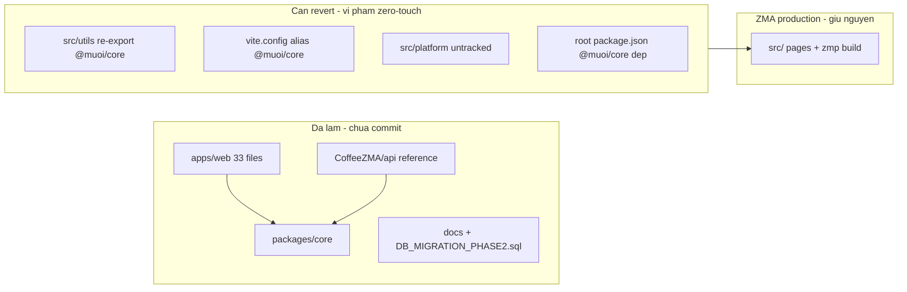
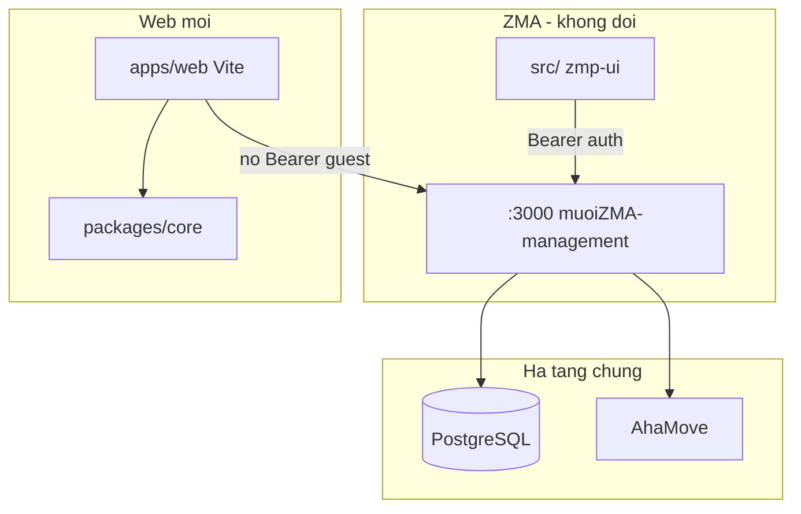
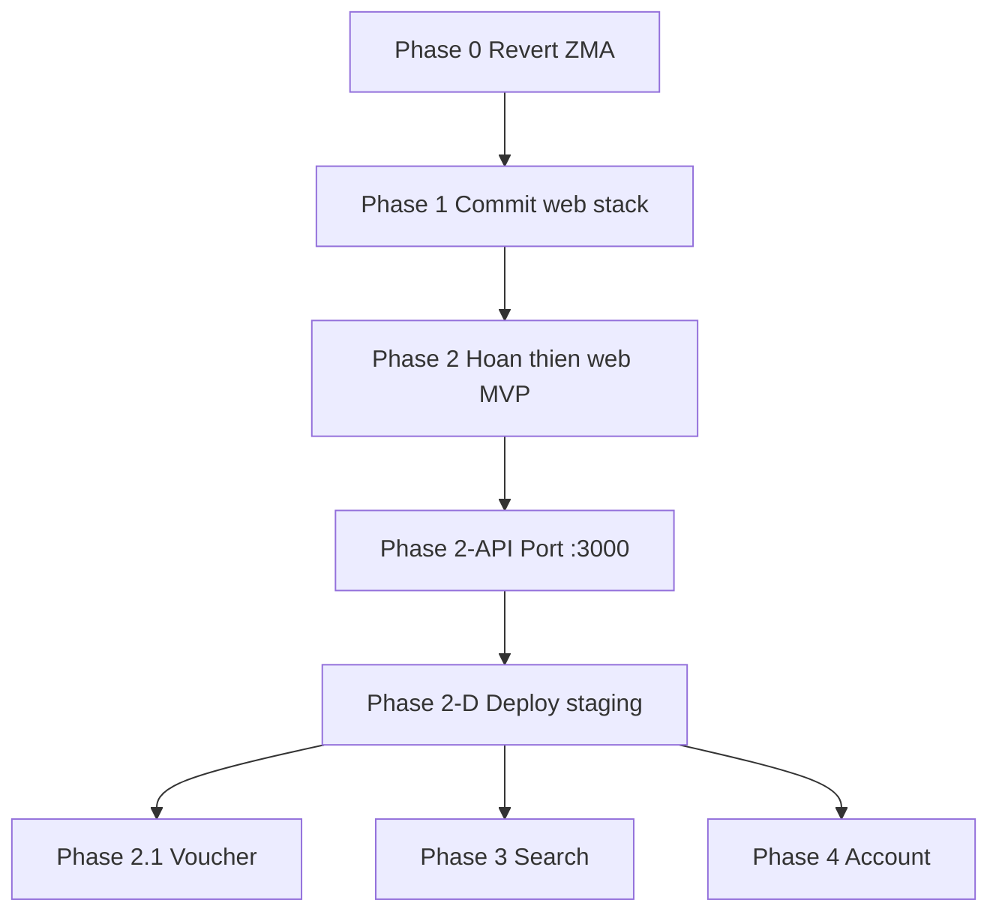

# Plan: Clone ZMA → Web Standalone (ZMA Zero-Touch)

## Bối cảnh & mục tiêu

**Mục tiêu:** Có web app chạy trên trình duyệt (không `zmp-ui` / `zmp-sdk`), khách có thể duyệt menu → giỏ → checkout COD → tra cứu đơn.

**Ràng buộc:** [ZMA `src/`](CoffeeZMA/src/) đang production — **không refactor, không coupling** với web.

**Quyết định deploy API:** Port endpoint **additive** vào [muoiZMA-management](muoiZMA-management) (`:3000`), không deploy `CoffeeZMA/api/` riêng làm backend chính. [`CoffeeZMA/api/`](CoffeeZMA/api/) giữ vai trò **reference + dev local** cho đến khi port xong.

---

## Trạng thái hiện tại (working tree)



| Hạng mục | Trạng thái | Ghi chú |
|----------|------------|---------|
| [`packages/core`](CoffeeZMA/packages/core) | Done | 18 tests pass; mirror logic từ ZMA utils |
| [`apps/web`](CoffeeZMA/apps/web) | ~95% MVP | Home, Category, Cart, Checkout, Success; Search/Profile/Notification = placeholder |
| [`CoffeeZMA/api`](CoffeeZMA/api) | Done (reference) | Port sang muoiZMA-management |
| [`DB_MIGRATION_PHASE2.sql`](CoffeeZMA/DB_MIGRATION_PHASE2.sql) | Written | Chưa apply production |
| ZMA `src/utils/*` | **Contaminated** | 6 file re-export `@muoi/core` — **phải revert** |
| `src/platform/` | Untracked, unused | Xóa hoặc không commit |
| Root [`package.json`](CoffeeZMA/package.json) | Modified | workspaces + `@muoi/core` dep — cần tách |

**Parity routes (ZMA vs Web):**

| ZMA ([`layout.tsx`](CoffeeZMA/src/components/layout.tsx)) | Web ([`App.tsx`](CoffeeZMA/apps/web/src/App.tsx)) |
|------------------------------------------------------------|---------------------------------------------------|
| `/`, `/category`, `/cart`, `/result` | `/`, `/category`, `/cart`, `/order/success` |
| `/search`, `/notification`, `/profile` | Placeholder |
| `/order-history`, `/order-status` | Chưa có |

---

## Kiến trúc mục tiêu



**Nguyên tắc coupling:**

- `@muoi/core` chỉ được import bởi `apps/web` và (tạm thời) `CoffeeZMA/api` dev — **không** import từ `src/`.
- Sửa giá/validation: cập nhật `@muoi/core` + port logic sang muoiZMA-management; ZMA `src/utils/` giữ bản gốc độc lập.
- DB migration chỉ **additive** (`ADD COLUMN IF NOT EXISTS`).

---

## Phase 0 — Khôi phục ZMA (bắt buộc trước commit)

**Mục tiêu:** `git diff src/` trống; ZMA build/start giống production.

### Việc cần làm

1. **Revert** về `HEAD` cho:
   - [`src/utils/checkout-validation.ts`](CoffeeZMA/src/utils/checkout-validation.ts)
   - [`src/utils/location.ts`](CoffeeZMA/src/utils/location.ts)
   - [`src/utils/loyalty.ts`](CoffeeZMA/src/utils/loyalty.ts)
   - [`src/utils/phone.ts`](CoffeeZMA/src/utils/phone.ts)
   - [`src/utils/pricing.ts`](CoffeeZMA/src/utils/pricing.ts)
   - [`src/utils/product.ts`](CoffeeZMA/src/utils/product.ts)
2. **Revert** [`vite.config.mts`](CoffeeZMA/vite.config.mts) — bỏ alias `@muoi/core` và `platform`.
3. **Revert** [`tsconfig.json`](CoffeeZMA/tsconfig.json) — bỏ paths `@muoi/core`, `platform`.
4. **Xóa** [`src/platform/`](CoffeeZMA/src/platform/) (chưa được page ZMA import).
5. **Sửa** root [`package.json`](CoffeeZMA/package.json):
   - Giữ `workspaces` + script `dev:web` / `test:core` (tiện dev, không đổi `start`/`build`/`deploy` ZMA).
   - **Bỏ** `"@muoi/core": "*"` khỏi `dependencies` root — chỉ khai báo trong `apps/web` và `api`.

### Gate kiểm tra

```bash
git diff src/ vite.config.mts tsconfig.json   # phải trống
npm start && npm run build                     # ZMA regression
npm run test:core && npm run test:web          # web stack vẫn pass
```

---

## Phase 1 — Hoàn thiện monorepo web-only

**Mục tiêu:** Cấu trúc repo ổn định, ZMA và web cùng repo nhưng tách biệt.

| Deliverable | Path |
|-------------|------|
| Shared logic (web) | [`packages/core`](CoffeeZMA/packages/core) |
| Web app | [`apps/web`](CoffeeZMA/apps/web) |
| API reference (local dev) | [`CoffeeZMA/api`](CoffeeZMA/api) |
| Plan tracking | [`docs/web-clone-plan.md`](CoffeeZMA/docs/web-clone-plan.md) — cập nhật theo plan mới |
| Contract | [`docs/api/orders-contract.md`](CoffeeZMA/docs/api/orders-contract.md) |

**Commit đầu tiên** chỉ gồm: `packages/`, `apps/`, `api/`, `docs/`, `DB_MIGRATION_PHASE2.sql`, thay đổi `package.json` tối thiểu (workspaces/scripts) — **không** `src/`.

---

## Phase 2 — Guest checkout MVP (web)

**Tiến độ hiện tại ~95%.** Còn lại trước khi coi là xong MVP:

### Đã có (giữ nguyên)

- Catalog: banners, categories, products, branches ([`services/catalog.ts`](CoffeeZMA/apps/web/src/services/catalog.ts))
- Product picker + variants ([`ProductPicker.tsx`](CoffeeZMA/apps/web/src/components/product/ProductPicker.tsx))
- Cart + checkout form ([`CheckoutPage.tsx`](CoffeeZMA/apps/web/src/pages/CheckoutPage.tsx))
- COD qua [`web.adapter.ts`](CoffeeZMA/apps/web/src/platform/web.adapter.ts)
- Order success + lookup code ([`OrderSuccessPage.tsx`](CoffeeZMA/apps/web/src/pages/OrderSuccessPage.tsx))
- Tests: 6 web + 18 core

### Còn thiếu (MVP)

| Task | Chi tiết |
|------|----------|
| Map address picker | ZMA dùng TrackAsia; web đang nhập text + lat/lng thủ công — port UI hoặc tích hợp map SDK web |
| Cart UX gần ZMA | ZMA gộp delivery + preview trong [`pages/cart/`](CoffeeZMA/src/pages/cart/); web tách `/cart` + `/checkout` — chấp nhận hoặc gộp tùy UX |
| `VITE_API_URL` production | Web trỏ `:3000` sau khi port API (Phase 2-API) |
| E2E manual | Home → chọn món → checkout COD → success có `lookupCode` |

---

## Phase 2-API — Port endpoint vào muoiZMA-management (`:3000`)

**Nguồn port:** logic từ [`CoffeeZMA/api/lib/`](CoffeeZMA/api/lib/) → TypeScript trong muoiZMA-management.

### Endpoint cần bổ sung / mở rộng

| Method | Path | Hành động |
|--------|------|-----------|
| `POST` | `/api/orders` | **Mở rộng** handler hiện có ([`app/api/orders/route.ts`](muoiZMA-management/app/api/orders/route.ts)): guest upsert by phone, server price validation (`@muoi/core` hoặc copy logic), `lookupCode`, response `201` theo [contract](CoffeeZMA/docs/api/orders-contract.md) |
| `POST` | `/api/shipping/estimate` | **Thêm mới** `app/api/shipping/estimate/route.ts` — proxy AhaMove v3 estimates (reuse `lib/ahamove.ts` + token hiện có) |
| `GET` | `/api/variants` | **Thêm mới** `app/api/variants/route.ts` — map `option_groups` → shape ZMA `Variant[]` (mirror [`api/lib/catalog.js`](CoffeeZMA/api/lib/catalog.js)) |
| `GET` | `/api/orders?id=` | Đảm bảo guest tra cứu sau checkout |

### Không phá ZMA — auth middleware

[`middleware.ts`](muoiZMA-management/middleware.ts) hiện tại:

- Chỉ enforce Bearer trên `/api/orders` khi **có** header `Authorization`.
- Không header → bypass (web guest).
- `/api/shipping/estimate`, `/api/variants` **ngoài** scope middleware → additive an toàn.

**Không** mở rộng middleware bắt buộc Bearer cho route mới.

### DB

1. Apply [`DB_MIGRATION_PHASE2.sql`](CoffeeZMA/DB_MIGRATION_PHASE2.sql) trên staging.
2. Smoke test **ZMA đặt hàng + Zalo Pay** sau migration.
3. Apply production khi staging pass.

### CORS

Mở rộng [`next.config.mjs`](muoiZMA-management/next.config.mjs): cho phép header `X-Guest-Session`, `Idempotency-Key` từ domain web.

### Dev local trong giai đoạn chuyển tiếp

```bash
# Option A: API reference chưa port xong
VITE_API_TARGET=http://localhost:3001 npm run dev:web   # CoffeeZMA/api

# Option B: sau port xong
VITE_API_URL=https://api.coool.cafe npm run dev:web     # :3000 production/staging
```

---

## Phase 2-D — Deploy production

| Component | Deploy | ZMA impact |
|-----------|--------|------------|
| Web static | Vercel / Cloudflare Pages — build `apps/web` | Không |
| API | muoiZMA-management `:3000` (đã có) | Chỉ additive routes |
| DB migration | Staging → prod + smoke ZMA | Thấp nếu chỉ ADD COLUMN |
| Env web | `VITE_API_URL` → domain `:3000` | Không |

**Checklist deploy:** mục trong [orders-contract.md § Port checklist](CoffeeZMA/docs/api/orders-contract.md).

---

## Phase 2.1 — Voucher (web)

- UI voucher trên checkout (tham chiếu ZMA [`voucherPicker`](CoffeeZMA/src/pages/cart/))
- `discount`, `voucherId`, `voucherCode` trong `POST /api/orders` (đã reserve trong contract)
- Server validate eligibility — reuse logic voucher ZMA backend nếu có

---

## Phase 3 — Khám phá & điều hướng

Tham chiếu ZMA [`src/pages/search/`](CoffeeZMA/src/pages/search/):

- `/search` + kết quả (client filter hoặc API search)
- Category swiper parity ([`index/categories.tsx`](CoffeeZMA/src/pages/index/categories.tsx))
- Thay [`PlaceholderPage`](CoffeeZMA/apps/web/src/pages/PlaceholderPage.tsx) cho `/search`

---

## Phase 4 — Tài khoản & giữ chân

| Feature | ZMA ref | Web approach (không Zalo SDK) |
|---------|---------|-------------------------------|
| Profile | [`profile.tsx`](CoffeeZMA/src/pages/profile.tsx) | Guest profile by phone / optional SMS OTP |
| Order history | [`order-history.tsx`](CoffeeZMA/src/pages/order-history.tsx) | `GET /api/orders` filter by phone |
| Order status | [`order-status.tsx`](CoffeeZMA/src/pages/order-status.tsx) | Tra cứu `lookupCode` |
| Notifications | [`notification.tsx`](CoffeeZMA/src/pages/notification.tsx) | Polling hoặc email/SMS — không Zalo OA |
| Loyalty | ZMA state + backend | Phase 4 optional; web-only earn nếu có `customerId` |
| Online payment | Zalo Pay | **Out of scope** — web giữ COD (+ SePay sau nếu cần) |

---

## Ma trận parity (cập nhật khi xong phase)

| Tính năng | ZMA | Web hiện tại | Phase |
|-----------|-----|--------------|-------|
| Catalog + variants | Yes | Yes | 2 |
| Cart + AhaMove fee | Yes | Yes | 2 |
| COD checkout | Yes | Yes | 2 |
| Map address | Yes | No | 2 |
| API production `:3000` | Yes | Pending port | 2-API |
| Voucher | Yes | No | 2.1 |
| Search | Yes | Placeholder | 3 |
| Profile / history / loyalty | Yes | Placeholder | 4 |
| Zalo Pay | Yes | N/A | — |

---

## Rủi ro & mitigation

| Rủi ro | Mitigation |
|--------|------------|
| Diff `src/` lọt vào commit | Phase 0 gate; CI check `git diff src/` empty trên PR web |
| `POST /api/orders` regression ZMA | Giữ nhánh Bearer; test ZMA checkout trên staging sau mỗi thay đổi handler |
| Pricing drift web vs ZMA | Document manual sync khi đổi giá; không share runtime |
| DB migration | Staging first + smoke ZMA |
| Port `@muoi/core` vào Next.js | Copy/port functions vào `muoiZMA-management/lib/pricing.ts` hoặc add workspace dep — **không** import từ ZMA `src/` |

---

## Thứ tự thực hiện đề xuất



**Ưu tiên ngay:** Phase 0 → Phase 1 commit → Phase 2-API (vì user chọn `:3000` additive) → staging E2E cả web và ZMA.
